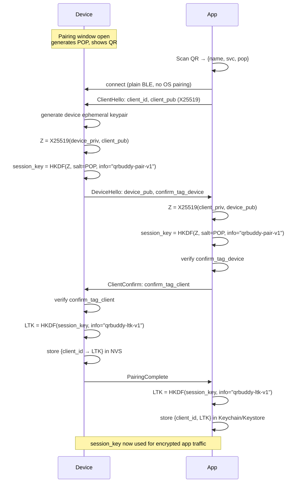
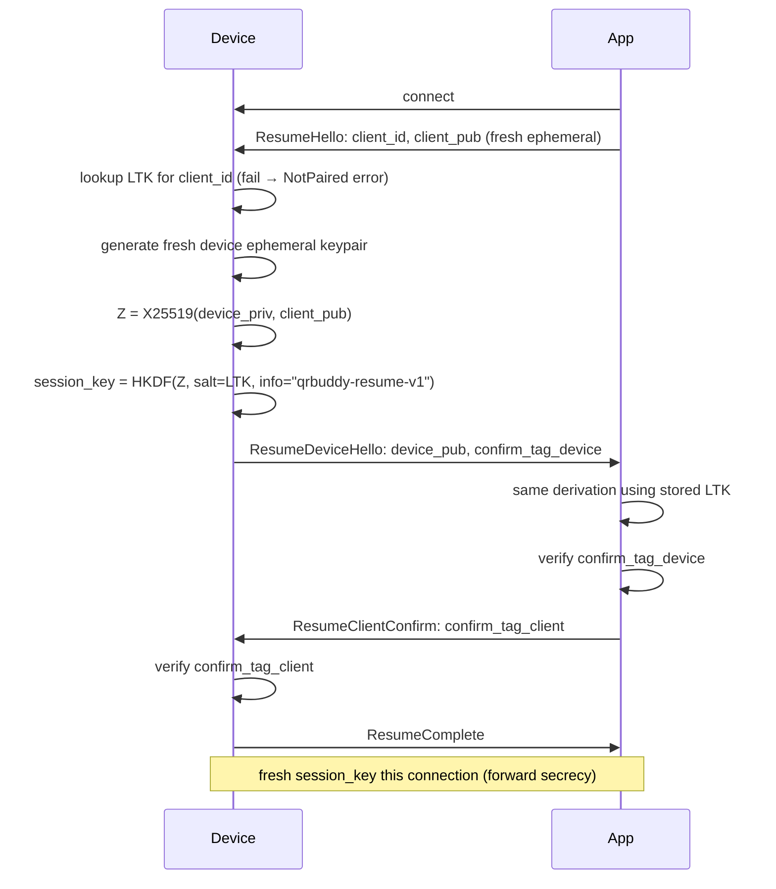

# qrbuddy — App-Level BLE Provisioning (QR + Proof-of-Possession)

Status: design draft, not yet implemented.
Audience: firmware implementer (this repo) + client (mobile app) developer.

## 1. Goal

Replace/avoid native BLE pairing (the OS-level "Enter the code shown on your
device" dialog) with an application-level scheme: the device shows a QR code
containing a short-lived proof-of-possession (POP) code, the app scans it,
and the two sides run a key exchange authenticated by that POP. All GATT
traffic is then encrypted at the payload level — native BLE pairing/bonding
is never invoked, so ATT permissions on our characteristics stay
"no security required" throughout.

This was chosen over native Passkey Entry pairing specifically to avoid the
iOS limitation where an app cannot programmatically un-pair a bonded device
(the user has to visit Settings → Bluetooth → Forget This Device). The
app-level scheme re-pairs cleanly on both platforms because it never touches
OS-level bonding state at all.

## 2. Threat model

**Protects against:**
- Passive eavesdropping on the BLE link (all app data is AES-GCM encrypted).
- An active BLE man-in-the-middle who did not see the QR code (they can
  observe/relay the public BLE handshake bytes, but can't derive the correct
  session key without the POP, so their messages fail AEAD/HMAC checks).
- A phone that was never provisioned trying to control the device (no
  stored trust entry → rejected).

**Does not protect against:**
- Someone who can see the device's screen (the QR/POP is, by design, the
  credential — this is "proof you're standing in front of the device," not
  proof of any deeper identity).
- Compromise of the phone's local key storage (Keychain/Keystore) after
  pairing.
- Physical/firmware-level attacks on the ESP32-C6 itself.

This is a reasonable bar for a personal device paired by its owner — not a
substitute for a managed enterprise credential system.

## 3. Two flows

### 3a. Pairing (first time, or after a reset)



### 3b. Resume (every later reconnect — no QR, no user action)



A fresh ephemeral key exchange on every connection (rather than reusing a
static session) means captured traffic from one session doesn't compromise
another, even though the long-term trust (`client_id → LTK`) is what's
actually persisted.

### 3c. Re-pairing (held upside-down for 5s at boot, or an authenticated "reset pairing" command)

The physical buttons on this unit are hard to reach, so the trigger is a
held gesture instead of a button: hold the unit upside-down while powering
it up (checked via the onboard QMI8658 accelerometer) for 5 continuous
seconds. Checked once at boot, before BLE comes up, so it works regardless
of whether pairing/advertising even succeed.

1. Device erases the stored `{client_id → LTK}` entry (and, if you extend to
   multiple trusted clients later, all of them — or a chosen one).
2. Device generates a new POP, opens a fresh pairing window, shows the QR.
3. Any previously-paired app's `ResumeHello` now fails lookup on the device
   (`NotPaired`) — the app should treat that as "please re-scan" and drop
   back into the pairing flow (3a). No OS-level state to clean up on the
   phone at all.

## 4. GATT layout

Reuses the existing control service; add two characteristics:

| Characteristic | Properties | Purpose |
|---|---|---|
| `PROV_STATE` | Read, Notify | 1 byte: `0` = unpaired/awaiting pairing, `1` = paired (idle), `2` = pairing window open |
| `PROV_HANDSHAKE` | Write, Notify | Carries the opcode-framed handshake messages below (both directions) |

The original design (v1 of this doc) had five fixed property
characteristics (a URL text value, four raw 4-byte slots). That's been
replaced with a single command characteristic instead — a fixed property
per feature doesn't scale as features are added, and a new command is just
a new opcode value rather than new GATT surface:

| Characteristic | Properties | Purpose |
|---|---|---|
| `CMD` | Write, Notify | `[opcode: 1 byte][payload: opcode-dependent]`, encrypted (§6) the same as everything else. Fire-and-forget for most opcodes; GetConfig's response is the one exception — see §5b. |

No new ATT permissions are needed on it; the device enforces "session
established" itself and treats undecryptable/absent-session/malformed
traffic as a no-op (a normal ATT write-response error, not an
application-level Nack).

## 5. Handshake wire format

Single byte opcode, followed by a fixed-layout payload (all multi-byte
integers little-endian; all keys/tags raw bytes, not base64, over BLE):

| Opcode | Name | Direction | Payload |
|---|---|---|---|
| `0x01` | ClientHello | App → Device | `client_id`(16) `client_pub`(32) |
| `0x02` | DeviceHello | Device → App | `device_pub`(32) `confirm_tag_device`(16) |
| `0x03` | ClientConfirm | App → Device | `confirm_tag_client`(16) |
| `0x04` | PairingComplete | Device → App | *(empty)* |
| `0x05` | ResumeHello | App → Device | `client_id`(16) `client_pub`(32) |
| `0x06` | ResumeDeviceHello | Device → App | `device_pub`(32) `confirm_tag_device`(16) |
| `0x07` | ResumeClientConfirm | App → Device | `confirm_tag_client`(16) |
| `0x08` | ResumeComplete | Device → App | *(empty)* |
| `0x7F` | Nack | Device → App | `reason`(1): `1`=not paired, `2`=bad confirm, `3`=pairing window closed, `4`=rate-limited |

## 5b. Command opcodes (`CMD`, post-pairing)

Same shape as the handshake — opcode byte + payload, this time carried
inside the AES-GCM envelope from §6 (so the whole `[opcode][payload]` blob
*is* the plaintext the app encrypts before writing `CMD`). Mostly app →
device only, with one exception: GetConfig's response comes back as its
own opcode, notified to the requesting connection (subscribe to `CMD`'s
notifications to receive it) — same "own opcode per message, even for a
request/response pair" convention as the handshake in §5, and the same
per-connection `ble_gatts_notify_custom` mechanism `PROV_HANDSHAKE`
already uses, not the shared-value `ble_gatts_chr_updated()` path (see §9
point 6's note on why that path can't do a real per-connection response).

| Opcode | Name | Direction | Payload |
|---|---|---|---|
| `0x01` | ShowQR | App → Device | `display_seconds`(2, little-endian) `purpose`(1) `text`(UTF-8, variable length, non-empty) |
| `0x02` | Idle | App → Device | *(empty)* — backlight off, blank the tile |
| `0x03` | DemoEffects | App → Device | *(empty)* — run the particle idle-effect cycle |
| `0x04` | SetConfig | App → Device | `config_type`(1) `value`(shape depends on `config_type`) |
| `0x05` | GetConfig | App → Device | `config_type`(1) |
| `0x06` | ConfigValue | Device → App | `config_type`(1) `value`(same shape as that type's SetConfig `value`) |

GetConfig only ever produces a ConfigValue notification when `config_type`
is recognized and the write itself succeeds — an unrecognized type is
rejected the same as a malformed opcode (a normal ATT write-response
error), same as every other command; no ConfigValue follows in that case.

**SetConfig's `config_type` values:**

| Value | Meaning | `value` | Applies |
|---|---|---|---|
| `0x00` | Orientation | 1 byte: `0`=0°, `1`=90°, `2`=180°, `3`=270° (clockwise) | After a restart |
| `0x01` | QRBrightness | 1 byte: backlight percentage, `0`-`100` | Immediately |

Like `purpose`, `config_type` is append-only — a new persisted setting is a
new value here, never a reused or renumbered one. **Whether a SetConfig
applies immediately depends on the setting** — Orientation doesn't (this
display stack has no live hardware-rotation API, so the device persists
the value and restarts a moment later to apply it through its normal boot
path instead; expect the connection to drop when this happens, that's the
restart, not a failure). QRBrightness has no such constraint and applies
right away, live, to whatever's on screen if a QR (or the pairing QR's
helper-text screen, which shares the same brightness) happens to already
be showing. Check each config type's own behavior rather than assuming
either way for future ones.

QRBrightness controls the backlight level while a QR code (or the pairing
flow's screens, which share it) is on screen — it does *not* affect the
particle idle effect's brightness, which stays fixed.

**ShowQR's fields:**
- `display_seconds`: how long the QR (and its progress bar) stays up before
  auto-hiding. `0` means *don't* time out — no auto-hide, and no progress
  bar shown at all (same behavior the pairing QR already uses internally).
- `purpose`: a single-byte enum. In **portrait** orientation only (see
  SetConfig below), a short caption is shown just below the code for the
  two purposes that have one so far; every other value is communicated but
  still shows nothing, same as before this existed:

  | Value | Meaning | Portrait caption |
  |---|---|---|
  | `0x00` | Receipt | "Hent kvittering" |
  | `0x01` | MobilePay | "MobilePay" |
  | `0x02` | AccountPay | *(none yet)* |
  | `0x03` | GiftCard | *(none yet)* |
  | `0x04` | LoyaltyCard | *(none yet)* |
  | `0x05` | Coupon | *(none yet)* |
  | `0x06` | MembershipSignup | *(none yet)* |

  In landscape orientation, no caption is shown regardless of `purpose` —
  this was a deliberate scope decision, not a space constraint.

  The pairing QR (§3a/§3c, not driven by `ShowQR` at all) gets a caption
  the same way, in portrait only: "Scan med Ka-ching POS". `purpose` isn't
  part of that flow's wire format — this is purely a firmware-internal
  detail — but it's worth knowing the same visual mechanism is behind it.

  An unrecognized value is rejected the same as a malformed opcode (a
  normal ATT write-response error), not silently defaulted.

Extending this: append a new opcode value, never renumber or reuse one
already shipped (deprecate by leaving it unused). Same rule for `purpose`'s
values. A device that doesn't recognize an opcode, or gets a payload that
doesn't match what that opcode expects, returns a normal ATT write-response
error — there's no application-level acknowledgement on success (decided
not needed for this product; add a `CMD_STATUS` read+notify characteristic
later if that changes).

`client_id` is 16 random bytes the app generates once at first pairing and
reuses on every future resume — it's just a lookup key, not a secret.

## 6. Crypto

- **Key agreement**: X25519 (Curve25519 ECDH). Both sides generate a fresh
  ephemeral keypair per handshake (pairing *and* resume) — never reuse a
  keypair across connections.
- **KDF**: HKDF-SHA256.
  - Pairing session key: `HKDF(ikm=Z, salt=POP_bytes, info="qrbuddy-pair-v1", len=32)`
  - Resume session key: `HKDF(ikm=Z, salt=stored_LTK, info="qrbuddy-resume-v1", len=32)`
  - Long-term key (minted once, right after a successful pairing confirm,
    independently by both sides — never sent over the air):
    `HKDF(ikm=session_key, info="qrbuddy-ltk-v1", len=32)`
- **Confirm tags** (direction-tagged to prevent a trivial echo/reflection):
  - `confirm_tag_device = HMAC-SHA256(session_key, "qrbuddy-confirm-device-v1")[0:16]`
  - `confirm_tag_client = HMAC-SHA256(session_key, "qrbuddy-confirm-client-v1")[0:16]`
- **App data**: AES-256-GCM, key = `session_key` directly (32 bytes — no
  truncation needed). Nonce (12 bytes) = `direction_byte`(1) `counter`(4,
  little-endian) `zero`(7) — same byte order as the wire framing below, no
  separate big-endian form — where `direction_byte` is `0x00` for
  app→device and `0x01` for device→app, and `counter` is a per-direction,
  per-connection counter starting at 0 (never persisted — a new connection
  means a new `session_key`, so counters can safely restart; the device, as
  receiver of app→device writes, doesn't independently track/enforce this
  counter — it just uses whatever value the sender included. Only the
  *sender* of each direction must never repeat a counter value within one
  connection, to avoid GCM nonce reuse; this isn't full replay protection,
  consistent with this doc's threat model in §2). Wire framing for an
  encrypted characteristic payload: `counter(4, little-endian) ||
  ciphertext_and_tag` (the direction byte isn't transmitted — it's implicit
  from which side is sending, and from that same byte order feeding the
  nonce above).

All of the above (X25519, HKDF, HMAC-SHA256, AES-GCM) are standard-library
primitives on every relevant platform:
- Firmware: mbedtls (bundled with ESP-IDF) — `mbedtls_ecp_gen_keypair`/
  `mbedtls_ecdh_compute_shared`/`mbedtls_ecp_point_write_binary`/
  `read_binary` with `MBEDTLS_ECP_DP_CURVE25519` (deliberately *not* the
  higher-level `mbedtls_ecdh_make_public`/`read_public` convenience API —
  those wrap the point in an extra TLS-style length-prefix byte we don't
  want on the wire), `mbedtls_md_hmac` (HKDF is hand-rolled as two HMAC
  calls per RFC 5869, since `MBEDTLS_HKDF_C` isn't enabled in this
  project's mbedtls config and a single 32-byte output block doesn't need
  the library's multi-block Expand loop anyway), `mbedtls_gcm_*`. All of
  this was verified against RFC 7748's own worked Diffie-Hellman example
  (§6.1) before implementation — see components/pairing/pairing.c.
- iOS: CryptoKit (`Curve25519.KeyAgreement`, `HKDF`, `HMAC`, `AES.GCM`).
- Android: `javax.crypto` + a modern provider (Conscrypt, or Google Tink)
  for X25519/HKDF; `AES/GCM/NoPadding` is available natively.

## 7. POP (proof-of-possession) code

- 8 characters, Crockford base32 alphabet (`0123456789ABCDEFGHJKMNPQRSTVWXYZ`
  — excludes ambiguous `I`/`L`/`O`/`U`), ~40 bits of entropy. Short enough to
  read aloud/type as a fallback if a QR scan fails; the QR is still the
  primary path.
- Generated fresh every time a pairing window opens (first boot, or after a
  reset), using the device's HRNG (`esp_fill_random`).
- **Pairing window**: closes automatically after a timeout (suggest 5
  minutes) if unused, and after some number of failed `ClientConfirm`
  attempts (suggest 5) — both cases return to normal idle behavior and
  require a fresh button-press/boot to reopen. This bounds how long an
  8-character code is guessable over the air.

## 8. QR payload

Compact JSON, encoded directly into the QR (reuses the existing `draw_qr`
renderer — same renderer already used for the URL-display feature, just fed
a different string):

```json
{"v":1,"name":"Ka-ching AA:BB:CC:DD:EE:FF","svc":"6E400010-XXXX-XXXX-XXXX-XXXXXXXXXXXX","pop":"7K2M9XAB"}
```

`name` disambiguates when multiple qrbuddy units are being provisioned near
each other (matches the existing advertised local name); `svc` is the
already-advertised control service UUID, so the app can `scanForPeripherals
(withServices:)`-filter directly.

## 9. Firmware implementation path

1. **Crypto helpers** — thin wrappers around mbedtls for: X25519 keypair
   gen + ECDH, HKDF-SHA256, HMAC-SHA256, AES-256-GCM encrypt/decrypt. Keep
   these as plain C (or a small Swift wrapper calling into mbedtls via the
   existing bridging-header pattern) — no need to hand-roll any primitive.
2. **NVS storage** — a small namespace (e.g. `qrb_pair`) holding, at most,
   one `{client_id(16) → LTK(32)}` entry for v1 (see §11 for multi-client).
   Empty/absent on first-ever boot.
3. **Boot-time state**: if no stored trust entry, enter pairing mode
   immediately (generate POP, render QR) — this is also what a factory-fresh
   unit does out of the box. If a trust entry exists, boot straight into
   normal idle behavior; `PROV_STATE` reads `1`.
4. **GATT additions**: add `PROV_STATE`/`PROV_HANDSHAKE` characteristics to
   the existing `setupGATTServer()` (or wherever the control service is
   defined) and a write handler implementing the opcode table in §5 (both
   the pairing and resume branches — they share almost all the logic, just
   differ in what's used as the HKDF salt and whether a new LTK gets minted
   at the end).
5. **Per-connection session state**: a small fixed-size table keyed by
   `conn_handle` (bounded by `CONFIG_BT_NIMBLE_MAX_CONNECTIONS`) holding
   `session_key` + the two per-direction nonce counters + whether the
   session is established. Clear the entry on disconnect.
6. **`CMD` write handler**: decrypt the write using the connection's
   `session_key` (no session established → treat as a no-op, a normal ATT
   error, never fall back to trusting plaintext), parse the opcode+payload
   per §5b, dispatch. See `GATTServer.swift`'s `Command` enum — adding a
   new command later is a new `case` there plus a line in `parse()`, not a
   GATT change.
7. **QR rendering**: feed the JSON payload from §8 into the existing
   `draw_qr` path instead of a URL — no renderer changes needed, just a
   different call site and string.
8. **Re-pairing trigger**: a boot-time check (physical buttons on this unit
   are hard to reach, so this polls the onboard QMI8658 accelerometer for 5
   continuous seconds of upside-down orientation instead) erases the NVS
   trust entry; the normal startup path then notices there's none and opens
   a fresh pairing window / renders the QR itself, no separate "re-render"
   step needed. (An authenticated `PROV_RESET` command over an
   already-established session, for a "reset pairing" button inside the app
   itself, is still a reasonable addition later — see the open question
   below.)
9. **Rate limiting / timeout**: track failed `ClientConfirm`/
   `ResumeClientConfirm` attempts and pairing-window age; enforce §7's
   limits by sending `Nack` and, once exceeded, closing the window (back to
   whatever the device would otherwise be showing).

## 10. Client implementation path

1. **BLE central**: standard scan (filter on the `svc` UUID from the QR) →
   connect. No native pairing/bonding requested at any point.
2. **QR scanning**: decode the JSON payload (§8) with any standard
   camera+QR library (`AVFoundation`/`Vision` on iOS, `CameraX`+`ML Kit` on
   Android).
3. **Crypto**: implement X25519 keygen/ECDH, HKDF-SHA256, HMAC-SHA256,
   AES-256-GCM exactly as specified in §6 — all available as
   platform-native APIs (CryptoKit / javax.crypto+Tink).
4. **Pairing flow**: generate (once, ever, per install) a random 16-byte
   `client_id`; on first-ever connection to a device (or after getting a
   `Nack(not paired)` on resume), run the §3a exchange over
   `PROV_HANDSHAKE`, verify `confirm_tag_device`, send
   `confirm_tag_client`, and on `PairingComplete` derive and persist
   `{client_id, LTK}` in Keychain/Keystore.
5. **Resume flow**: on every later connection, run §3b using the stored
   `client_id`/`LTK` — no user interaction, no QR.
6. **Sending commands**: build `[opcode][payload]` per §5b, encrypt with the
   per-connection `session_key` and the nonce/framing scheme in §6, write to
   `CMD`. Write-only, no response payload to read back — a failed write
   (bad session, unknown opcode, malformed payload) surfaces as a normal
   ATT write error.
7. **Error/UX handling**:
   - `Nack(not paired)` on resume → drop into the pairing flow, prompt the
     user to scan the QR again (covers first-ever use and post-reset).
   - `Nack(bad confirm)` / `Nack(rate-limited)` during pairing → surface a
     clear retry prompt (wrong/expired code).
   - Handle a mid-handshake disconnect by just retrying the whole handshake
     on reconnect — nothing is partially committed on the device side until
     `ClientConfirm` succeeds.

## 11. Open questions / deliberately deferred

- **Multi-client support**: v1 above stores a single trusted `client_id`.
  Extending to a small fixed list (e.g. a few family members' phones) is a
  storage-shape change only (NVS holds a list instead of one entry, resume
  does a lookup instead of an equality check) — not a protocol redesign.
  Worth deciding before the client dev builds their local-storage layer, in
  case "one trusted phone at a time" isn't actually the desired product
  behavior.
- **In-app "reset pairing"**: §9 mentions an authenticated `PROV_RESET`
  command as an alternative to the physical button. Decide whether that's
  wanted for v1 or left for later.
- **Exact POP length/timeout/lockout numbers** in §7 are suggestions, not
  fixed — tune once real usage patterns (how long someone typically takes
  to scan) are known.
